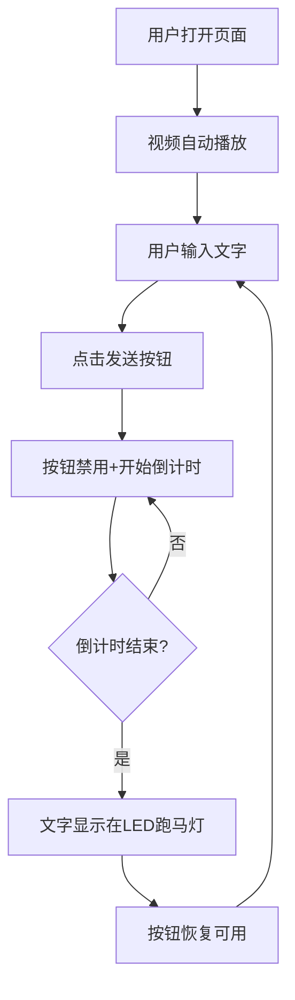

# 视频验厂Demo 需求说明书

## 一、项目背景

### 1.1 业务场景
外贸工厂在与海外采购商合作时，采购商往往对工厂的真实性和生产能力存在疑虑。传统的图片、视频资料容易造假，无法建立有效的信任关系。

### 1.2 解决方案
通过**实时视频直播 + 互动验证**的方式，让海外采购商能够远程"验厂"。采购商可以发送特定文字，该文字会在工厂现场的LED显示屏上实时展示，通过直播画面确认文字已显示，从而证明直播的真实性。

### 1.3 Demo目的
本Demo用于向客户演示该解决方案的核心体验效果，帮助客户直观理解产品价值。

---

## 二、功能需求

### 2.1 核心功能流程

```
用户输入文字 → 点击发送 → 等待10秒倒计时 → 文字显示在视频画面的LED跑马灯上
```

### 2.2 功能模块

| 模块 | 功能描述 |
|------|----------|
| 视频播放区 | 播放工厂场景的mp4视频，自动循环播放，静音 |
| LED跑马灯显示 | 叠加在视频画面上，模拟真实LED显示屏效果 |
| 文字输入区 | 用户输入想要显示的文字内容 |
| 发送按钮 | 触发文字发送流程 |
| 倒计时显示 | 显示10秒等待时间，模拟网络传输延迟 |

### 2.3 详细功能说明

#### 2.3.1 视频播放
- 支持加载本地mp4文件
- 自动循环播放（loop）
- 静音播放（muted）
- 自动开始播放（autoplay）

#### 2.3.2 LED跑马灯显示屏
- **位置**：叠加在视频画面内，位置可配置（建议在视频画面的上方或下方区域）
- **样式**：模拟真实LED显示屏效果
  - 黑色/深色背景
  - 红色/橙色/绿色LED点阵字体效果
  - 文字滚动动画（从右向左滚动）
- **视觉融合**：需要让LED显示屏看起来像是视频画面的一部分，增强真实感

#### 2.3.3 文字输入与发送
- 提供文本输入框，支持中英文输入
- 限制文字长度（建议50字符以内）
- 发送按钮点击后：
  1. 按钮变为禁用状态
  2. 开始10秒倒计时
  3. 倒计时结束后，文字显示在LED跑马灯上
  4. 按钮恢复可用状态

#### 2.3.4 倒计时功能
- 显示"文字将在 X 秒后显示"
- 从10秒倒数至0秒
- 可考虑添加进度条视觉效果

---

## 三、界面设计要求

### 3.1 整体布局
```
┌─────────────────────────────────────────┐
│              页面标题/Logo               │
├─────────────────────────────────────────┤
│  ┌───────────────────────────────────┐  │
│  │                                   │  │
│  │         视频播放区域              │  │
│  │                                   │  │
│  │  ┌─────────────────────────────┐  │  │
│  │  │    LED跑马灯显示屏          │  │  │
│  │  └─────────────────────────────┘  │  │
│  │                                   │  │
│  └───────────────────────────────────┘  │
├─────────────────────────────────────────┤
│  [文字输入框________________] [发送]    │
│            倒计时: 10秒                 │
└─────────────────────────────────────────┘
```

### 3.2 视觉风格
- 整体风格：专业、现代、科技感
- 配色：深色背景为主，突出视频和LED显示效果
- LED显示屏：需要有发光效果，模拟真实LED质感

---

## 四、技术要求

### 4.1 技术栈
- **纯前端实现**：HTML + CSS + JavaScript
- **无需后端服务**
- **无需复杂框架**，原生技术即可

### 4.2 兼容性
- 支持现代浏览器（Chrome、Firefox、Safari、Edge）
- 支持PC端访问

### 4.3 文件结构
```
/demo
├── index.html      # 主页面
├── style.css       # 样式文件
├── script.js       # 交互逻辑
└── video.mp4       # 工厂视频素材（用户提供）
```

---

## 五、交互流程



---

## 六、验收标准

1. ✅ 视频能够自动循环静音播放
2. ✅ LED跑马灯显示屏视觉效果逼真，看起来像在视频画面内
3. ✅ 用户输入文字后，准确等待10秒后显示
4. ✅ 文字以滚动方式在LED屏上展示
5. ✅ 倒计时显示清晰
6. ✅ 整体界面美观、专业

---

## 七、后续扩展（不在本Demo范围内）

- 接入真实直播流替代mp4视频
- 通过IM技术将文字发送到物理LED显示屏
- 多语言支持
- 移动端适配
- 历史消息记录

---

**文档版本**：v1.0  
**创建日期**：2026年1月14日

