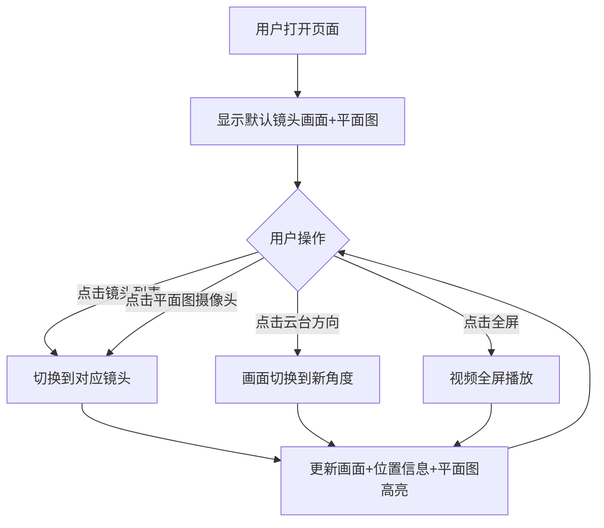

# 视频验厂Demo 需求说明书（远程摄像头控制版）

## 一、项目背景

### 1.1 业务场景
外贸工厂在与海外采购商合作时，采购商往往对工厂的真实性和生产能力存在疑虑。传统的图片、视频资料容易造假，无法建立有效的信任关系。

### 1.2 解决方案
通过**远程摄像头实时控制**的方式，让海外采购商能够远程"验厂"。采购商可以：
- **切换不同镜头**：查看工厂不同区域（车间、仓库、办公区等）
- **控制云台转动**：自由调整摄像头角度，360°查看周围环境
- **查看位置标识**：通过平面图了解当前镜头所在位置

这种"我来操控、实时响应"的方式，让采购商产生"身临其境巡视工厂"的体验，从而建立信任。

### 1.3 Demo目的
本Demo用于向客户演示该解决方案的核心体验效果，帮助客户直观理解产品价值。Demo采用预录视频模拟摄像头画面，展示完整的交互逻辑。

---

## 二、功能需求

### 2.1 核心功能流程

```
用户进入页面 → 看到厂房平面图和镜头列表 → 选择镜头 → 查看实时画面 → 控制云台转动 → 切换其他镜头继续探索
```

### 2.2 功能模块

| 模块 | 功能描述 |
|------|----------|
| 视频播放区 | 显示当前选中摄像头的实时画面（Demo用预录视频模拟） |
| 镜头选择器 | 显示所有可用镜头列表，支持快速切换 |
| 云台控制器 | 提供上/下/左/右方向控制，调整摄像头视角 |
| 厂房平面图 | 显示工厂布局，标注各摄像头位置 |
| 位置信息区 | 显示当前镜头所在区域的名称和简介 |

### 2.3 详细功能说明

#### 2.3.1 视频播放区
- 显示当前选中摄像头的画面
- 支持全屏播放
- 画面左上角显示摄像头名称水印（如：#1 生产车间-东）
- 画面右上角显示实时时间戳（模拟真实监控效果）
- Demo实现：使用预录视频模拟，不同"角度"对应不同视频片段

#### 2.3.2 镜头选择器
- **列表展示**：显示所有可用摄像头，包含：
  - 缩略图预览
  - 摄像头名称
  - 所在区域
  - 在线状态指示灯（绿色=在线）
- **当前选中高亮**：明确标识当前正在查看的镜头
- **快速切换**：点击任一镜头即可切换画面
- **镜头数量提示**：页面顶部显示"共X个镜头可查看"

#### 2.3.3 云台控制器
- **方向控制**：
  - 上：摄像头向上转动
  - 下：摄像头向下转动
  - 左：摄像头向左转动
  - 右：摄像头向右转动
- **控制方式**：
  - 点击按钮控制
  - 支持键盘方向键控制（可选）
- **视觉反馈**：
  - 按下时按钮高亮
  - 画面平滑过渡到新角度
- **Demo实现**：预设多个角度的视频片段，点击方向后切换到对应片段

#### 2.3.4 厂房平面图
- **布局展示**：简化的工厂俯视平面图
- **摄像头标注**：在平面图上用图标标注每个摄像头位置
- **交互功能**：
  - 点击平面图上的摄像头图标可切换到该镜头
  - 当前查看的摄像头图标高亮/放大
  - 悬停显示摄像头名称
- **视觉效果**：
  - 摄像头图标带方向指示（显示拍摄朝向）
  - 当前选中的摄像头有扫描/脉冲动画效果

#### 2.3.5 位置信息区
- **区域名称**：如"生产车间 A区"
- **区域简介**：2-3句话介绍该区域功能
  - 例："这是我们的主要生产车间，拥有20条自动化产线，日产能达50000件。"
- **设备信息**（可选）：该区域主要设备清单

---

## 三、界面设计要求

### 3.1 整体布局

```
┌──────────────────────────────────────────────────────────────┐
│  LOGO    远程视频验厂系统        共 6 个镜头可查看           │
├────────────────────────────────────┬─────────────────────────┤
│                                    │                         │
│   ┌────────────────────────────┐   │   ┌─────────────────┐   │
│   │ #1 生产车间-东    10:32:15 │   │   │   厂房平面图    │   │
│   │                            │   │   │                 │   │
│   │                            │   │   │   ◉1  ◎2  ◎3   │   │
│   │      视频播放区域          │   │   │                 │   │
│   │                            │   │   │   ◎4  ◎5  ◎6   │   │
│   │                            │   │   │                 │   │
│   │                            │   │   └─────────────────┘   │
│   └────────────────────────────┘   │                         │
│                                    │   ┌─────────────────┐   │
│   ┌────────────────────────────┐   │   │ 📍 生产车间 A区 │   │
│   │       ▲                    │   │   │                 │   │
│   │    ◄  ●  ►   云台控制      │   │   │ 主要生产车间，  │   │
│   │       ▼                    │   │   │ 20条自动化产线  │   │
│   └────────────────────────────┘   │   └─────────────────┘   │
│                                    │                         │
├────────────────────────────────────┴─────────────────────────┤
│  镜头列表                                                     │
│  ┌──────┐ ┌──────┐ ┌──────┐ ┌──────┐ ┌──────┐ ┌──────┐      │
│  │ 🟢   │ │ 🟢   │ │ 🟢   │ │ 🟢   │ │ 🟢   │ │ 🟢   │      │
│  │ 缩略 │ │ 缩略 │ │ 缩略 │ │ 缩略 │ │ 缩略 │ │ 缩略 │      │
│  │ 车间A│ │ 车间B│ │ 仓库 │ │ 质检 │ │ 办公 │ │ 门厅 │      │
│  └──────┘ └──────┘ └──────┘ └──────┘ └──────┘ └──────┘      │
└──────────────────────────────────────────────────────────────┘
```

### 3.2 视觉风格
- **整体风格**：专业监控系统风格，简洁高效
- **配色方案**：
  - 主背景：深灰/深蓝色（#1a1a2e 或类似）
  - 强调色：科技蓝（#00d4ff）
  - 在线状态：绿色（#00ff88）
  - 文字：白色/浅灰
- **视频区域**：深色边框，带轻微发光效果，模拟监控屏幕
- **平面图**：简洁线条图，浅色线条在深色背景上

### 3.3 响应式考虑
- PC端为主要展示场景
- 视频区域保持16:9比例
- 小屏幕时平面图和位置信息可折叠

---

## 四、技术要求

### 4.1 技术栈
- **纯前端实现**：HTML + CSS + JavaScript
- **无需后端服务**（Demo阶段）
- **无需复杂框架**，原生技术即可

### 4.2 Demo模拟实现

由于Demo阶段无真实摄像头，采用以下模拟方案：

| 真实功能 | Demo模拟方式 |
|----------|--------------|
| 实时摄像头画面 | 预录的工厂视频循环播放 |
| 云台转动 | 准备多个角度的视频片段，点击方向后切换 |
| 多镜头切换 | 准备多个不同区域的视频，点击镜头后切换 |
| 实时时间戳 | 前端JS生成当前时间覆盖在视频上 |

### 4.3 视频素材需求

| 镜头 | 需要的视频素材 |
|------|----------------|
| 镜头1-生产车间A | 中心视角、左转视角、右转视角（各10-30秒循环） |
| 镜头2-生产车间B | 中心视角、左转视角、右转视角 |
| 镜头3-仓库区 | 中心视角、左转视角、右转视角 |
| 镜头4-质检区 | 中心视角、左转视角、右转视角 |
| 镜头5-办公区 | 中心视角、左转视角、右转视角 |
| 镜头6-门厅入口 | 中心视角、左转视角、右转视角 |

> 注：如素材有限，可先用3-4个镜头演示，每个镜头至少准备1个视频。

### 4.4 兼容性
- 支持现代浏览器（Chrome、Firefox、Safari、Edge）
- 支持PC端访问

### 4.5 文件结构
```
/demo
├── index.html          # 主页面
├── style.css           # 样式文件
├── script.js           # 交互逻辑
├── assets/
│   ├── floor-plan.svg  # 厂房平面图
│   └── camera-icon.svg # 摄像头图标
└── videos/
    ├── cam1-center.mp4 # 镜头1 中心视角
    ├── cam1-left.mp4   # 镜头1 左转视角
    ├── cam1-right.mp4  # 镜头1 右转视角
    ├── cam2-center.mp4
    └── ...
```

---

## 五、交互流程



---

## 六、数据配置

### 6.1 摄像头数据结构

```javascript
const cameras = [
  {
    id: 1,
    name: "生产车间 A区",
    shortName: "车间A",
    description: "主要生产车间，拥有20条自动化产线，日产能达50000件。配备先进的德国进口设备。",
    position: { x: 20, y: 30 },  // 在平面图上的位置(百分比)
    direction: 45,               // 摄像头朝向(角度)
    videos: {
      center: "videos/cam1-center.mp4",
      left: "videos/cam1-left.mp4",
      right: "videos/cam1-right.mp4",
      up: "videos/cam1-up.mp4",
      down: "videos/cam1-down.mp4"
    },
    thumbnail: "thumbnails/cam1.jpg",
    online: true
  },
  // ... 更多摄像头
];
```

---

## 七、验收标准

1. ✅ 页面加载后显示默认镜头画面，视频自动播放
2. ✅ 清晰显示可用镜头数量（"共X个镜头可查看"）
3. ✅ 镜头列表展示所有摄像头，带缩略图和在线状态
4. ✅ 点击镜头可切换画面，切换流畅
5. ✅ 云台控制按钮可用，点击后画面有对应变化
6. ✅ 厂房平面图正确显示，摄像头位置标注清晰
7. ✅ 点击平面图上的摄像头图标可切换镜头
8. ✅ 当前镜头在平面图和列表中有明显高亮标识
9. ✅ 位置信息区显示当前镜头的区域名称和介绍
10. ✅ 视频画面带时间戳水印，模拟真实监控效果
11. ✅ 整体界面专业、美观、有科技感

---

## 八、用户体验要点

### 8.1 建立信任感的关键设计
- **即时响应**：云台控制点击后立即有画面变化反馈
- **空间认知**：平面图让用户始终知道"我在看哪里"
- **自由探索**：多镜头+云台让用户感觉"我想看哪里就看哪里"
- **真实感**：时间戳、摄像头编号、监控风格UI增强真实感

### 8.2 引导设计
- 首次进入可显示简短提示："点击下方镜头或平面图切换视角，使用云台控制调整方向"
- 平面图上未查看过的摄像头可有轻微提示动画

---

## 九、后续扩展（不在本Demo范围内）

- 接入真实网络摄像头和云台控制协议（ONVIF/GB28181）
- 多用户同时查看时的云台控制权限管理
- 画面缩放（Zoom）功能
- 截图/录制功能
- 语音对讲功能
- 移动端适配
- 预约验厂时间段功能

---

**文档版本**：v2.0  
**创建日期**：2026年1月17日  
**更新说明**：从LED文字验证方案改为远程摄像头控制方案
